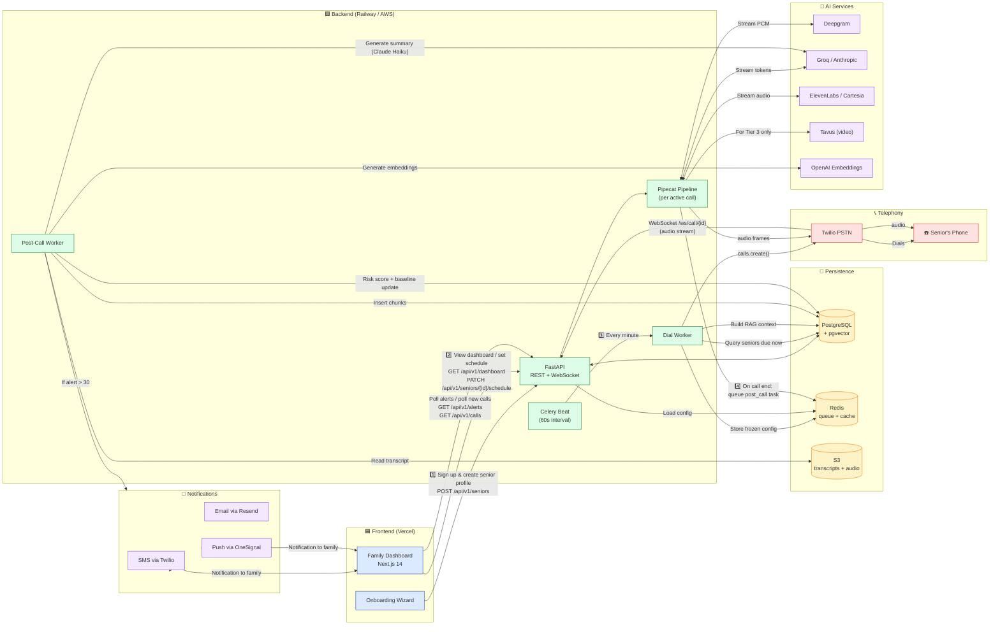
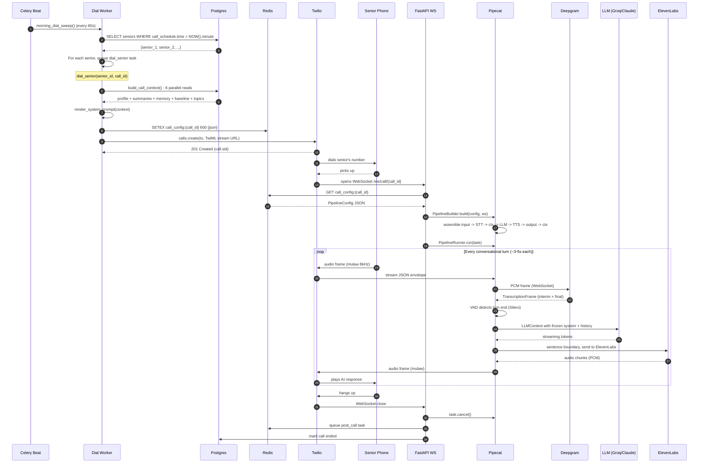
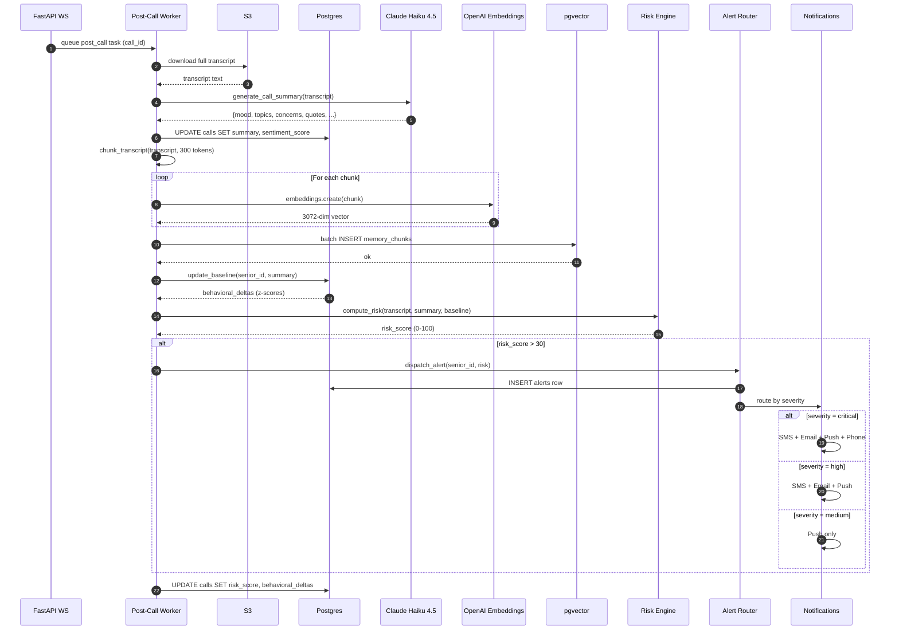

# WellRing — Complete System Architecture

> **Document Purpose:** End-to-end architectural reference for WellRing. Three Mermaid diagrams (frontend, backend, full connectivity) plus a glossary explaining every component, every API call, and exactly when each function runs in the pipeline.

---

## Table of Contents

1. [Frontend Architecture](#1-frontend-architecture)
2. [Backend Architecture](#2-backend-architecture)
3. [Full System Connectivity](#3-full-system-connectivity)
4. [Component Glossary](#4-component-glossary)
5. [API Contracts](#5-api-contracts)
6. [Live Call Pipeline (Sequence)](#6-live-call-pipeline-sequence-diagram)
7. [Post-Call Pipeline (Sequence)](#7-post-call-pipeline-sequence-diagram)
8. [When Each Function Runs](#8-when-each-function-runs)

---

## 1. Frontend Architecture

This diagram shows the complete Next.js 14 frontend — routes, components, state, theme, and the API client layer that talks to the backend.

```mermaid
flowchart TB
    subgraph USER["👤 Family Member (Buyer)"]
        Browser["Browser / Mobile Browser"]
    end

    subgraph NEXTJS["🟦 Next.js 14 App Router (frontend/)"]
        direction TB

        subgraph PUBLIC["Public Routes"]
            Landing["/landing<br/>page.tsx"]
            Login["/login<br/>page.tsx"]
            Onboarding["/onboarding<br/>page.tsx<br/>5-step wizard"]
        end

        subgraph PROTECTED["Protected Routes (under DashboardLayout)"]
            DashLayout["dashboard/layout.tsx<br/>Sidebar + Topbar + Drawer"]
            DashHome["/dashboard<br/>Overview + metrics"]
            DashCalls["/dashboard/calls<br/>Call history + filters"]
            DashAlerts["/dashboard/alerts<br/>Severity inbox"]
            DashProfile["/dashboard/profile<br/>Senior identity"]
            DashBaseline["/dashboard/baseline<br/>30-day trends"]
            DashSettings["/dashboard/settings<br/>Schedule + billing"]
        end

        subgraph LANDING_COMP["Landing Sub-components<br/>(src/components/landing/)"]
            LNav["LandingNav.tsx"]
            LHero["LandingHero.tsx"]
            LFeatures["LandingFeatures.tsx"]
            LPrev["FeatureCardPreviews.tsx"]
            LHow["LandingHowItWorks.tsx"]
            LStats["LandingStatsBand.tsx"]
            LPricing["LandingPricing.tsx"]
            LTest["LandingTestimonials.tsx"]
            LFaces["SeniorFaces.tsx"]
            LFooter["LandingFooter.tsx"]
        end

        subgraph SHARED["Shared UI Layer"]
            ShadCN["shadcn/ui components<br/>Button, Card, Dialog, Tabs"]
            Lucide["lucide-react icons"]
            Themes["next-themes<br/>light/dark toggle"]
            Tokens["Design tokens<br/>Primary #1a6b55<br/>Accent #d85a30<br/>DM Serif + DM Sans"]
        end

        subgraph STATE["Client State"]
            ReactState["React useState/useReducer"]
            ContextAPI["Auth + Theme Context"]
            SWR["SWR / React Query<br/>(planned)"]
        end

        subgraph APIC["API Client Layer<br/>(planned: src/lib/api/)"]
            ApiClient["apiClient.ts<br/>fetch wrapper with JWT"]
            AuthAPI["authApi.ts<br/>login, signup"]
            SeniorAPI["seniorApi.ts<br/>CRUD seniors"]
            CallAPI["callApi.ts<br/>list, get, schedule"]
            AlertAPI["alertApi.ts<br/>list, acknowledge"]
            DashAPI["dashboardApi.ts<br/>aggregated views"]
        end
    end

    subgraph EXTERNAL["External"]
        Backend["🟩 FastAPI Backend<br/>localhost:8000 / api.wellring.com"]
        Clerk["🔐 Clerk Auth<br/>(JWT issuance)"]
    end

    Browser --> Landing
    Browser --> Login
    Landing -->|"Get Started"| Onboarding
    Login -->|"Authenticated"| DashHome
    Onboarding -->|"Complete"| DashHome

    DashLayout --> DashHome
    DashLayout --> DashCalls
    DashLayout --> DashAlerts
    DashLayout --> DashProfile
    DashLayout --> DashBaseline
    DashLayout --> DashSettings

    Landing --> LNav
    Landing --> LHero
    Landing --> LFeatures
    LFeatures --> LPrev
    Landing --> LHow
    Landing --> LStats
    Landing --> LPricing
    Landing --> LTest
    Landing --> LFaces
    Landing --> LFooter

    DashHome --> ShadCN
    DashCalls --> ShadCN
    DashAlerts --> ShadCN
    ShadCN --> Tokens
    ShadCN --> Lucide
    DashLayout --> Themes

    DashHome --> ReactState
    DashCalls --> SWR
    Login --> ContextAPI

    SWR --> ApiClient
    Login --> AuthAPI
    DashProfile --> SeniorAPI
    DashCalls --> CallAPI
    DashAlerts --> AlertAPI
    DashHome --> DashAPI

    ApiClient -->|"Bearer JWT<br/>HTTPS"| Backend
    AuthAPI -->|"JWT validation"| Clerk

    classDef public fill:#e1f5ee,stroke:#1a6b55,color:#134d3d
    classDef protected fill:#fff,stroke:#1a6b55,color:#134d3d
    classDef external fill:#fef3c7,stroke:#d85a30,color:#92400e
    classDef shared fill:#f3f4f6,stroke:#555,color:#222

    class Landing,Login,Onboarding public
    class DashHome,DashCalls,DashAlerts,DashProfile,DashBaseline,DashSettings,DashLayout protected
    class Backend,Clerk external
    class ShadCN,Lucide,Themes,Tokens shared
```



### Frontend Flow Logic

- **Entry:** User hits `/` → redirects to `/landing` → either signs up (`/onboarding`) or logs in (`/login`).
- **Auth:** Clerk issues JWT on successful auth, stored in HttpOnly cookie. Every subsequent API call attaches it via `apiClient.ts`.
- **Dashboard:** `dashboard/layout.tsx` wraps every `/dashboard/*` route with sidebar + topbar + mobile drawer. `usePathname()` highlights the active nav item.
- **Data fetching:** SWR/React Query hooks call typed functions in `src/lib/api/*.ts` which call the FastAPI backend over HTTPS with the JWT.
- **Theme:** `next-themes` class strategy — every component already supports `dark:` modifier styling.

---

## 2. Backend Architecture

This is the complete FastAPI + Celery + Pipecat backend. Five distinct layers: API, services, repositories, workers, and the Pipecat pipeline that runs during live calls.

```mermaid
flowchart TB
    subgraph CLIENT["Inbound Traffic"]
        FE["Frontend<br/>(Next.js)"]
        TwilioWH["Twilio Webhooks<br/>status callbacks"]
        StripeWH["Stripe Webhooks<br/>billing"]
        TwilioWS["Twilio Media<br/>Streams (WebSocket)"]
    end

    subgraph FASTAPI["🟩 FastAPI App (backend/app/)"]
        direction TB

        subgraph MAIN["Entry"]
            App["main.py<br/>FastAPI() + lifespan"]
            Config["core/config.py<br/>Pydantic Settings"]
            Security["core/security.py<br/>JWT decode (Clerk)"]
            Logging["core/logging.py<br/>structlog + Logfire"]
        end

        subgraph ROUTERS["api/v1/ (REST + WebSocket)"]
            RAuth["auth.py<br/>session validation"]
            RFam["families.py<br/>plan management"]
            RSen["seniors.py<br/>CRUD seniors"]
            RCall["calls.py<br/>REST + WS /ws/call/{id}"]
            RAlert["alerts.py<br/>list, ack, resolve"]
            RDash["dashboard.py<br/>aggregated views"]
            RConsent["consent.py<br/>voice/likeness upload"]
            RWeb["webhooks.py<br/>Twilio + Stripe"]
        end

        subgraph SERVICES["services/ (Business Logic)"]
            SvcSummary["summaries.py<br/>Claude Haiku 4.5<br/>structured extraction"]
            SvcNotif["notifications.py<br/>SMS / Email / Push"]
            SvcBilling["billing.py<br/>Stripe integration"]
        end

        subgraph SAFETY["safety/ (Risk Engine)"]
            SafeHard["hard_flags.py<br/>regex pattern matching"]
            SafeBaseline["baseline_engine.py<br/>z-score computation"]
            SafeRisk["risk_engine.py<br/>combined scoring"]
            SafeAlert["alert_router.py<br/>severity → channel"]
        end

        subgraph RAG["rag/ (Pre-Call Context)"]
            RAGEng["engine.py<br/>build_call_context()"]
            RAGPrompt["prompt_builder.py<br/>render_system_prompt()"]
            RAGVec["vector_store.py<br/>pgvector HNSW search"]
            RAGCal["calendar_context.py<br/>anniversaries, appts"]
        end

        subgraph PIPELINE["pipeline/ (Pipecat — live call)"]
            PipeBuild["builder.py<br/>PipelineBuilder.build()"]
            PipeConf["config.py<br/>PipelineConfig"]
            PipeSTT["components/stt.py<br/>DeepgramSTTService"]
            PipeLLM["components/llm.py<br/>Groq / Anthropic"]
            PipeTTS["components/tts.py<br/>ElevenLabs / Cartesia"]
            PipeCtx["components/context.py<br/>LLMContextAggregator"]
        end

        subgraph TELEPHONY["telephony/"]
            TwilioH["twilio_handler.py<br/>TwilioFrameSerializer"]
            ExotelH["exotel_handler.py<br/>ExotelFrameSerializer"]
            DialMgr["dial_manager.py<br/>provider routing"]
        end

        subgraph VIDEO["video/ (Tier 3)"]
            TavusC["tavus_client.py<br/>Replica + Conv API"]
            VideoP["video_pipeline.py<br/>TavusTransport"]
        end

        subgraph VOICE["voice_clone/"]
            ElevenC["elevenlabs_client.py<br/>PVC creation"]
            CartesiaC["cartesia_client.py<br/>Sonic-3 fallback"]
        end

        subgraph CONSENT["consent/"]
            Vault["vault.py<br/>encrypted at rest"]
            Disclosure["disclosure_scheduler.py<br/>every 10th call"]
        end

        subgraph REPOS["db/repositories/ (Data Access)"]
            RepoSen["seniors.py"]
            RepoCall["calls.py"]
            RepoMem["memory.py"]
            RepoAlert["alerts.py"]
            RepoFam["families.py"]
        end

        subgraph DB_LAYER["db/"]
            Session["session.py<br/>asyncpg engine"]
            Models["models.py<br/>SQLAlchemy ORM"]
        end

        subgraph WORKERS["workers/ (Celery)"]
            CelBeat["celery beat<br/>(every 60s)"]
            CelSweep["morning_sweep.py<br/>find due seniors"]
            CelDial["dial_senior task<br/>RAG + Twilio call"]
            CelPost["post_call task<br/>summarise + embed + score"]
            CelAlert["alert_dispatch task"]
        end
    end

    subgraph DATA["💾 Data Layer"]
        PG["PostgreSQL 16<br/>+ pgvector HNSW<br/>(Supabase)"]
        Redis["Redis<br/>Celery queue +<br/>frozen PipelineConfig"]
        S3["S3 / Supabase Storage<br/>transcripts + consent recordings"]
    end

    subgraph EXT["🌐 External AI Services"]
        TwilioAPI["Twilio REST<br/>+ PSTN"]
        DG["Deepgram Nova-3<br/>(STT WebSocket)"]
        GroqAPI["Groq Llama-3.3-70B<br/>(LLM)"]
        AnthAPI["Anthropic Claude<br/>Sonnet 4.5 + Haiku 4.5"]
        EL["ElevenLabs<br/>turbo_v2_5 + PVC"]
        Cart["Cartesia Sonic-3"]
        Tavus["Tavus CVI<br/>(video avatar)"]
        OAI["OpenAI<br/>text-embedding-3-large"]
    end

    FE --> RAuth
    FE --> RFam
    FE --> RSen
    FE --> RCall
    FE --> RAlert
    FE --> RDash
    FE --> RConsent
    TwilioWH --> RWeb
    StripeWH --> RWeb
    TwilioWS --> RCall

    RAuth --> Security
    Security -.->|"validates"| App
    RCall --> PipeBuild
    RConsent --> Vault
    RConsent --> ElevenC
    RConsent --> TavusC

    RSen --> RepoSen
    RCall --> RepoCall
    RAlert --> RepoAlert
    RDash --> RepoCall
    RDash --> RepoAlert
    RFam --> RepoFam

    RepoSen --> Session
    RepoCall --> Session
    RepoMem --> Session
    Session --> Models
    Models --> PG

    CelBeat --> CelSweep
    CelSweep --> RepoSen
    CelSweep -->|"fan out"| CelDial
    CelDial --> RAGEng
    RAGEng --> RAGVec
    RAGEng --> RAGCal
    RAGEng --> RepoSen
    RAGEng --> RepoCall
    RAGEng --> RepoMem
    RAGVec --> PG
    RAGEng --> RAGPrompt
    CelDial --> Redis
    CelDial --> DialMgr
    DialMgr --> TwilioAPI

    RCall --> Redis
    PipeBuild --> PipeConf
    PipeBuild --> TwilioH
    PipeBuild --> ExotelH
    PipeBuild --> PipeSTT
    PipeBuild --> PipeLLM
    PipeBuild --> PipeTTS
    PipeBuild --> PipeCtx
    PipeSTT --> DG
    PipeLLM --> GroqAPI
    PipeLLM --> AnthAPI
    PipeTTS --> EL
    PipeTTS --> Cart

    VideoP --> Tavus
    VideoP --> DG
    VideoP --> AnthAPI
    VideoP --> EL

    RCall -->|"on call end"| CelPost
    CelPost --> SvcSummary
    SvcSummary --> AnthAPI
    CelPost --> RAGVec
    RAGVec --> OAI
    CelPost --> SafeRisk
    SafeRisk --> SafeHard
    SafeRisk --> SafeBaseline
    SafeBaseline --> RepoCall
    CelPost --> SafeAlert
    SafeAlert --> CelAlert
    CelAlert --> SvcNotif
    SvcNotif --> TwilioAPI

    Vault --> S3
    RepoCall -->|"transcripts"| S3
    ElevenC --> EL
    TavusC --> Tavus

    SvcBilling --> StripeWH

    Disclosure --> RAGPrompt

    classDef api fill:#dbeafe,stroke:#1e40af,color:#1e3a8a
    classDef svc fill:#fef3c7,stroke:#d97706,color:#92400e
    classDef worker fill:#fce7f3,stroke:#be185d,color:#9f1239
    classDef data fill:#dcfce7,stroke:#15803d,color:#14532d
    classDef ext fill:#f3e8ff,stroke:#7c3aed,color:#5b21b6
    classDef pipe fill:#fed7aa,stroke:#ea580c,color:#9a3412

    class RAuth,RFam,RSen,RCall,RAlert,RDash,RConsent,RWeb api
    class SvcSummary,SvcNotif,SvcBilling,SafeHard,SafeBaseline,SafeRisk,SafeAlert,RAGEng,RAGPrompt,RAGVec,RAGCal svc
    class CelBeat,CelSweep,CelDial,CelPost,CelAlert worker
    class PG,Redis,S3 data
    class TwilioAPI,DG,GroqAPI,AnthAPI,EL,Cart,Tavus,OAI ext
    class PipeBuild,PipeConf,PipeSTT,PipeLLM,PipeTTS,PipeCtx pipe
```



### Backend Layer Responsibilities

| Layer | Responsibility | Latency Sensitivity |
|---|---|---|
| **API Routers** | HTTP/WebSocket entry, Pydantic validation, auth | High — must respond < 200ms |
| **Services** | Business logic (summarise, notify, bill) | Low — async background |
| **Safety** | Risk scoring, baseline computation | Low — post-call only |
| **RAG** | Pre-call context assembly | High — < 150ms (parallel reads) |
| **Pipeline** | Live conversation loop (Pipecat) | Critical — < 350ms round-trip |
| **Repositories** | Async DB access (no business logic) | High — must be fast |
| **Workers** | Async tasks (dial, post-call, alerts) | Low — runs in background |

---

## 3. Full System Connectivity

This is the complete end-to-end view — how the frontend, backend, databases, and external services all connect. The numbered flows show the four primary scenarios.



### The Four Primary Flows

| # | Flow | Trigger | Path |
|---|---|---|---|
| 1️⃣ | **Onboarding** | User completes wizard | Frontend → POST `/api/v1/seniors` → Postgres |
| 2️⃣ | **Dashboard view** | User opens any `/dashboard/*` page | Frontend → GET `/api/v1/...` → Postgres |
| 3️⃣ | **Outbound call** | Celery Beat (every minute) | Worker → RAG → Redis → Twilio → WebSocket → Pipecat → Senior's phone |
| 4️⃣ | **Post-call processing** | Pipecat fires on call end | Worker → Summary → Embeddings → Risk scoring → Alerts → Notifications |

---

## 4. Component Glossary

Use this section as a quick lookup for what each file or service owns. The glossary is grouped by layer first, then by component type, so the compiled PDF/HTML is easier to scan.

### 4.1 Frontend Components

#### Route Pages

**`frontend/src/app/landing/page.tsx`**

The public marketing page. Server component. Imports every sub-component from `src/components/landing/`. No state. No API calls. Renders once at build time, revalidates on push.

**`frontend/src/app/onboarding/page.tsx`**

5-step wizard. Client component (`"use client"`). Local React state holds wizard step + form data. On final step, calls `POST /api/v1/families` then `POST /api/v1/seniors` then redirects to `/dashboard`.

**`frontend/src/app/dashboard/layout.tsx`**

Shared shell for all dashboard pages. Renders sidebar (with `usePathname()` active detection), topbar, and mobile drawer. Uses Clerk's `<SignedIn>` guard to redirect unauthenticated users to `/login`.

**`frontend/src/app/dashboard/page.tsx`**

Overview page. Fetches `/api/v1/dashboard/overview` on mount. Shows metrics strip, 7-day mood chart, latest call summary, unread alerts. Auto-refreshes every 60 seconds (SWR `refreshInterval: 60000`).

**`frontend/src/app/dashboard/calls/page.tsx`**

Call history. Fetches `/api/v1/calls?limit=50`. Filter tabs (All/Voice/Video/Missed) drive query params. Expandable rows show summary, topics, concern warnings. Play button hits `/api/v1/calls/{id}/audio` returning a signed S3 URL.

**`frontend/src/app/dashboard/alerts/page.tsx`**

Alert inbox. Fetches `/api/v1/alerts?status=unresolved`. Mark-as-resolved button issues `PATCH /api/v1/alerts/{id}` with `{status: "resolved"}` and shows an undo toast for 5 seconds.

**`frontend/src/app/dashboard/baseline/page.tsx`**

Behavioral baseline view. Fetches `/api/v1/seniors/{id}/baseline` returning today's metrics vs baseline mean/std. Renders dual progress bars + 30-day mood bar chart (recharts).

**`frontend/src/app/dashboard/settings/page.tsx`**

Schedule management + consent vault + billing. Time picker + day toggles write to `PATCH /api/v1/seniors/{id}/schedule`. Voice clone re-record button opens a modal that uploads to `POST /api/v1/consent/voice-clone`.

#### API Client

**`src/lib/api/apiClient.ts`** *(to be created)*

Single source of truth for backend calls. Wraps `fetch()`, attaches JWT from Clerk, retries on 401 with token refresh, normalises errors. Every other `*Api.ts` file imports this.

---

### 4.2 Backend Components

#### App Core

**`backend/app/main.py`**

FastAPI app factory. Mounts all `/v1` routers, configures CORS for the frontend domain, sets up lifespan hooks (open DB pool on startup, close on shutdown). Loads Sentry + Logfire integration.

**`backend/app/core/config.py`**

Pydantic `BaseSettings` class. Reads from `.env`. Every secret is typed as `SecretStr`. Used everywhere via `from app.core.config import settings`.

**`backend/app/core/security.py`**

JWT validation. Uses Clerk's public key to decode tokens. `get_current_user()` is a FastAPI dependency injected into every protected route.

#### API Routers

**`backend/app/api/v1/calls.py`**

Two responsibilities:

- **REST endpoints:** GET `/calls`, GET `/calls/{id}`, POST `/calls/schedule`.
- **WebSocket endpoint:** `/ws/call/{call_id}` - opened by Twilio Media Streams when a senior picks up. Reads frozen `PipelineConfig` from Redis, builds the Pipecat pipeline, runs it until disconnect.

**`backend/app/api/v1/seniors.py`**

CRUD for senior profiles. Schedule updates write to `seniors.call_schedule` JSONB column. Baseline endpoint returns computed metrics from `baselines` table.

**`backend/app/api/v1/webhooks.py`**

Twilio status callbacks (`call.completed`, `call.failed`), Stripe billing events. Verifies signatures before processing.

#### RAG Context

**`backend/app/rag/engine.py`**

`build_call_context(senior_id)` fires 6 async DB reads in parallel via `asyncio.gather()`. Target latency < 150ms total. Returns a frozen `CallContext` dataclass.

**`backend/app/rag/prompt_builder.py`**

`render_system_prompt(context)` translates `CallContext` into a natural-language system prompt. Includes the persona, disclosure rule, recent summaries, top recurring topics, today's context, and behavioral directives.

**`backend/app/rag/vector_store.py`**

pgvector wrapper. `search(senior_id, query, k, threshold)` pre-filters by `senior_id` then runs HNSW cosine search. `batch_insert(senior_id, call_id, chunks)` generates embeddings via OpenAI and bulk-inserts to `memory_chunks`.

#### Live Call Pipeline

**`backend/app/pipeline/builder.py`**

`PipelineBuilder.build(config, websocket)` assembles the Pipecat pipeline:

```
transport.input() -> STT -> user_aggregator -> LLM -> TTS -> transport.output() -> assistant_aggregator
```

Returns a `PipelineTask` ready to run via `PipelineRunner`.

**`backend/app/pipeline/config.py`**

`PipelineConfig` Pydantic model. Frozen at dial time, serialized to JSON, stored in Redis. Contains tier, telephony provider, voice ID, Tavus replica ID, frozen system_instruction string, disclosure state.

#### Safety

**`backend/app/safety/risk_engine.py`**

`compute_risk(senior_id, transcript, summary)` combines hard flags + per-senior z-scores + protective factors into a single 0-100 score.

**`backend/app/safety/baseline_engine.py`**

`update_baseline(senior_id, transcript, summary)` computes today's metrics, updates rolling 7-day window, recomputes 30-day baseline mean/std, writes to `baselines` table.

**`backend/app/safety/alert_router.py`**

`dispatch_alert(senior_id, call_id, risk)` maps severity to channels:

- 31-60: push notification only
- 61-85: push + SMS + email
- 86-100: push + SMS + email + phone call to primary contact

#### Workers

**`backend/app/workers/morning_sweep.py`**

Celery Beat target. Runs every 60 seconds. Queries `seniors` table for rows where `call_schedule.time` matches current minute + day matches current weekday. Fans out one `dial_senior(senior_id, call_id)` task per match.

**`backend/app/workers/tasks.py` - `dial_senior`**

Builds RAG context, renders frozen prompt, stores `PipelineConfig` in Redis with 10-min TTL, calls `twilio_client.calls.create()` with the WebSocket URL as TwiML stream target.

**`backend/app/workers/post_call.py`**

Triggered by the WebSocket endpoint when the call disconnects. Reads transcript from S3, calls Claude Haiku 4.5 for structured summary, chunks transcript and embeds via OpenAI, updates baseline, computes risk, dispatches alerts if warranted.

---

### 4.3 Data Layer

#### Storage Services

**PostgreSQL 16 + pgvector**

Single database for relational + vector. Tables: `families`, `users`, `seniors`, `consent_records`, `calls`, `memory_chunks`, `recurring_topics`, `alerts`, `baselines`. HNSW index on `memory_chunks.embedding`.

**Redis**

Two roles:

- **Celery queue:** `dial_out` priority lane and `post_call` lane.
- **Frozen call config:** `SETEX call_config:{call_id} 600 {json}` so WebSocket endpoint doesn't hit Postgres during live call.

**S3 / Supabase Storage**

Encrypted at rest. Stores: full transcripts (90-day TTL), consent recordings (active for life of consent), call audio recordings (only if family opted in).

---

## 5. API Contracts

| Method | Path | Purpose | Called By |
|---|---|---|---|
| POST | `/api/v1/auth/session` | Validate Clerk JWT, return user record | Login flow |
| POST | `/api/v1/families` | Create family + initial user | Onboarding step 1 |
| GET | `/api/v1/families/me` | Current family + plan | Dashboard layout |
| POST | `/api/v1/seniors` | Create senior profile | Onboarding step 2 |
| GET | `/api/v1/seniors/{id}` | Senior profile + cards | Profile page |
| PATCH | `/api/v1/seniors/{id}` | Update profile fields | Profile editor |
| PATCH | `/api/v1/seniors/{id}/schedule` | Update call schedule | Settings page |
| GET | `/api/v1/seniors/{id}/baseline` | Today vs baseline metrics | Baseline page |
| GET | `/api/v1/calls` | List calls (paginated) | Calls page |
| GET | `/api/v1/calls/{id}` | Single call + transcript URL | Expandable row |
| GET | `/api/v1/calls/{id}/audio` | Signed S3 URL for playback | Play button |
| GET | `/api/v1/alerts` | List alerts (filtered) | Alerts page |
| PATCH | `/api/v1/alerts/{id}` | Mark resolved / acknowledged | Resolve button |
| GET | `/api/v1/dashboard/overview` | Aggregated home view | Dashboard home |
| POST | `/api/v1/consent/voice-clone` | Upload consent recording | Voice clone modal |
| POST | `/api/v1/consent/likeness` | Upload likeness recording | Avatar modal |
| WS | `/ws/call/{call_id}` | Live call audio (Twilio) | Twilio Media Streams |
| POST | `/api/v1/webhooks/twilio/status` | Twilio call status callback | Twilio |
| POST | `/api/v1/webhooks/stripe` | Stripe billing events | Stripe |

---

## 6. Live Call Pipeline (Sequence Diagram)

This is exactly what happens during one 5-minute voice call, from the moment Celery Beat fires to the moment the senior hangs up.



### Key Latency Budget (per turn)

| Step | Target | Why |
|---|---|---|
| Audio in → STT final | < 100ms | Deepgram streaming |
| STT → LLM first token | < 150ms | Frozen prompt + caching |
| LLM token → TTS first byte | < 75ms | ElevenLabs Flash/Turbo |
| TTS → audio out | < 50ms | Pipecat serializer |
| **Total round-trip** | **< 350ms** | Natural conversation feel |

---

## 7. Post-Call Pipeline (Sequence Diagram)

What happens after the senior hangs up — runs entirely async, doesn't affect any user.



---

## 8. When Each Function Runs

This is the cheat sheet — what gets called and exactly when.

### Continuous (always running)
| Component | Runs |
|---|---|
| FastAPI Uvicorn workers | Always — 4-8 processes serving HTTP + WS |
| Celery Beat | Always — fires `morning_dial_sweep` every 60s |
| Celery workers | Always — listen on `dial_out` and `post_call` queues |

### Triggered by user (frontend → backend)
| Action | What runs |
|---|---|
| User opens dashboard | GET `/api/v1/dashboard/overview` → Postgres → response |
| User updates schedule | PATCH `/api/v1/seniors/{id}/schedule` → Postgres |
| User uploads voice clone | POST `/api/v1/consent/voice-clone` → S3 + ElevenLabs PVC API |
| User resolves alert | PATCH `/api/v1/alerts/{id}` → Postgres |

### Triggered by clock (Celery Beat)
| Time | What runs |
|---|---|
| Every 60s | `morning_dial_sweep` checks who's due, fans out `dial_senior` tasks |
| For each due senior | `dial_senior` → RAG → Redis → Twilio.calls.create() |

### Triggered by phone (Twilio → backend)
| Event | What runs |
|---|---|
| Senior picks up | Twilio opens WebSocket → FastAPI builds Pipecat pipeline |
| Per conversation turn | Pipecat: STT → LLM → TTS → audio frame back to Twilio |
| Senior hangs up | WebSocket closes → `post_call` task queued |

### Triggered by call end (post-call worker)
| Step | What runs |
|---|---|
| 1 | Read transcript from S3 |
| 2 | Claude Haiku 4.5 → structured summary |
| 3 | OpenAI embeddings → pgvector insert |
| 4 | Baseline engine → z-score update |
| 5 | Risk engine → 0-100 score |
| 6 | If score > 30 → alert router → notifications |

---

## 9. Tech Stack Summary

| Layer | Tech | Purpose |
|---|---|---|
| Frontend framework | Next.js 14 (App Router) | UI + routing |
| Frontend styling | Tailwind CSS 3 + shadcn/ui | Components + tokens |
| Frontend theme | next-themes | Light/dark mode |
| Backend framework | FastAPI (Python 3.12) | Async REST + WebSocket |
| Database | PostgreSQL 16 + pgvector | Relational + vector |
| Cache / Queue | Redis | Celery + frozen config |
| Object storage | S3 / Supabase Storage | Transcripts + audio |
| Task queue | Celery + Celery Beat | Scheduled + async tasks |
| Auth | Clerk | JWT issuance + frontend SDK |
| Pipeline | Pipecat AI | Live conversation orchestration |
| Telephony | Twilio (MVP) → Exotel (India scale) | PSTN dialing |
| STT | Deepgram Nova-3 | Speech to text |
| LLM (live) | Groq Llama-3.3-70B | Tier 1/2 live conversation |
| LLM (live, premium) | Anthropic Claude Sonnet 4.5 | Tier 3 video calls |
| LLM (post-call) | Anthropic Claude Haiku 4.5 | Summarisation |
| TTS | ElevenLabs Turbo v2.5 + PVC | Voice clone synthesis |
| TTS fallback | Cartesia Sonic-3 | Cost / latency fallback |
| Embeddings | OpenAI text-embedding-3-large | Memory chunks |
| Video | Tavus CVI | Real-time avatar (Tier 3) |
| Notifications | Twilio SMS + Resend + OneSignal | Multi-channel alerts |
| Observability | Sentry + Logfire + PostHog | Errors + LLM traces + analytics |
| Hosting (frontend) | Vercel | Static + edge functions |
| Hosting (backend) | Railway (MVP) → AWS (scale) | Compute + workers |

---

**Document version:** 1.0 · Generated 24 May 2026 · Companion to WellRing Blueprint + Business Plan + Backend Architecture v2
